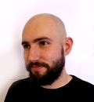

    
I am a software developer from Copenhagen specializing in functional programming. My main language of choice
is Haskell because its strong static type-system and lazy semantics provides a strong foundation to write safe,
correct and compositional software

I have a Master\'s degree in Software Development and Technology from the IT University of Copenhagen.
You can `find my thesis here<https://lybaek.adamschoenemann.dk/f/af8692d18b944ba5ab2d/?dl=1>`_.

You can send me a mail at ``adamschoenemann`` at gmail, and also find me 
on `GitHub<https://github.com/adamschoenemann>`_ and 
`LinkedIn<https://www.linkedin.com/in/adamschoenemann/>`_.

I am currently looking for a job as a functional programmer in the Copenhagen
area or remotely in Europe.

Aside from programming I listen to a lot of music, mostly metal. I also am an 
avid drummer, primarily in the band `ORM<https://www.facebook.com/ormband/>`_.
